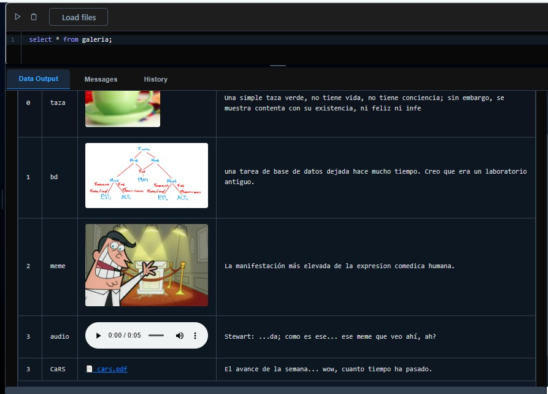

# 📘 Informe Técnico – Proyecto 1: Base de Datos 2

Este informe presenta la **primera parte del proyecto** del curso **Base de Datos 2**, enfocándose en la implementación de técnicas de **indexación**, así como en los algoritmos desarrollados para operaciones fundamentales como:

- 📥 Inserción  
- 🔍 Búsqueda  
- ❌ Eliminación  

Se ha desarrollado un **mini gestor de bases de datos** que:

- Soporta indexación eficiente de datos **multidimensionales**
- Administra la organización de **archivos físicos**
- Incluye un **Parser SQL** conectado a una API
- Presenta un **frontend interactivo** para demostrar la funcionalidad

---

## ❓ ¿Por qué usar distintos tipos de índices?

Inspirado en gestores como **PostgreSQL**, este proyecto implementa diversos tipos de índices, ya que **cada técnica tiene sus fortalezas** dependiendo del caso de uso.

> 🔑 *Ejemplo*: Para búsquedas por rango, un índice **B+ Tree** es más eficiente que uno de tipo **Hash** (que no soporta `rangeSearch`).

### 🧪 Ejemplo SQL

```sql
create table destinos (
    id int primary key index hash,
    name varchar[25] index seq,
    latitud double,
    longitud double,
    ciudad varchar[20] index bptree,
    pais varchar[20]
);
create index on destinos using rtree(latitud, longitud);
```
🔎 En este ejemplo se combinan:
- `hash` para identificadores
- `seq` para nombres
- `bptree` para textos ordenables
- `rtree` para coordenadas espaciales

Como la tabla tiene atributos de distintos tipos (IDs, nombres, coordenadas), se asigna a cada uno el índice más óptimo según su naturaleza.

## 🎯 Resultados Esperados
Se espera que, con la implementación de los índices, las operaciones fundamentales (búsqueda, inserción y eliminación) deberían de tomar menos tiempo computacional que realizando un Full Table Scan, es decir, no usar ningún índice.

## 🧱 Estructura del Proyecto
El proyecto está estructurado en dos grandes partes:
```
📦 Proyecto_BD2/
│
├── 🔙 Backend
│   ├── Base de datos
│   ├── Índices (5 tipos)
│   ├── ParserSQL
│   └── API RESTful
│
├── 💻 Frontend
│   └── Interfaz de usuario
```

Para almacenar todos los registros de una tabla, se decidió usar la estructura del [Heap file](https://github.com/stewartmb/Proyecto_BD2/blob/main/Heap_struct/Hepa.md). Sobre esta estructura es donde se aplicarán las técnicas de indexación.
Aparte, se implementó una clase [Registro](https://github.com/stewartmb/Proyecto_BD2/blob/main/Utils/RegistroREADME.md) personalizada.

## 📂 Índices Implementados
En cuanto a los **índices**, se han implementado los siguientes:


| Tipo de Índice         | Descripción                                         | Documentación                                                                              |
| ---------------------- | --------------------------------------------------- | ------------------------------------------------------------------------------------------ |
| 📄 Sequential File     | Búsqueda ordenada secuencial                        | [Ver](https://github.com/stewartmb/Proyecto_BD2/blob/main/Sequential_Struct/Sequential.md) |
| 🗂 ISAM                | Índice jerárquico con dos niveles                   | [Ver](https://github.com/stewartmb/Proyecto_BD2/tree/main/Isam_struct/ISAM.md)             |
| #️⃣ Extendible Hashing | Hash dinámico para inserciones eficientes           | [Ver](https://github.com/stewartmb/Proyecto_BD2/blob/main/Hash_struct/Hash.md)             |
| 🌳 B+ Tree             | Árbol balanceado para búsquedas por rango           | [Ver](https://github.com/stewartmb/Proyecto_BD2/blob/main/BPtree_struct/BTree.md)          |
| 🗺 R-Tree              | Índice espacial para coordenadas multidimensionales | [Ver](https://github.com/stewartmb/Proyecto_BD2/blob/main/RTree_struct/Rtree.md)           |
| 🗒️ BRIN               | Índice compacto que resume rangos de bloques para datos ordenados | [Ver](https://github.com/stewartmb/Proyecto_BD2/blob/main/Brin_struct/Brin.md)           |
| 📚 SPIMI              | Implementación basada en hash que permite indexar colecciones textuales | [Ver](https://github.com/stewartmb/Proyecto_BD2/blob/main/Spimi_struct/benchmarks.md) |
| 🧠 SIFT               | Extracción y búsqueda de características visuales locales | [Ver](https://github.com/stewartmb/Proyecto_BD2/blob/main/SIFT_struct/IVF.md)             |


## 🧠 Parser SQL
Se ha desarrollado un componente ParserSQL que interpreta y ejecuta sentencias SQL básicas, utilizando los índices implementados.
[ParserSQL](https://github.com/stewartmb/Proyecto_BD2/blob/main/ParserSQL/Parser.md)

## 🔌 API RESTful
La API desarrollada en Python permite:

- Crear y gestionar tablas

- Insertar, buscar y eliminar datos

- Ejecutar consultas a través del ParserSQL

- Interactuar con el frontend

[Documentación de la API](https://github.com/stewartmb/Proyecto_BD2/blob/main/API/README.md)


## 🌐 Frontend
Se ha creado una interfaz web sencilla e intuitiva para:

- Visualizar las tablas y los datos almacenados

- Ejecutar comandos SQL desde el navegador

- Ver los resultados en tiempo real
  
- Se incorpora visualización de los datos multimedia en la tabla de resultados



### Tutorial

Para poder realizar consultas se deben realizar los siguientes pasos:

1) Colocar la url en la que se está ejecutando el backend en el campo de texto de la barra lateral. Guardar esto usando `Set URL` y presionar `Refresh` para que se muestre el esquema con las tablas almacenado en el backend. Luego de hacer cambios es necesario volver a presionar refresh para mostrarlos; esto es para evitar una actualizacion automatica constante pese a que ningun cambio haya sido realizado.


2) Una vez conectado con el backend, se puede escribir consultas en la sintaxis especificada en el [parser](https://github.com/stewartmb/Proyecto_BD2/blob/main/ParserSQL/Parser.md) ya mencionado.


3) Presionando el boton `Load Files`, se accede a un nuevo apartado en el cual se pueden cargar archivos. Para esto se puede hacer clic para abrir el explorador de archivos local, o arrastrar directamente los archivos.


4) Aqui se mostrarán los archivos cargados en una especie de galería con funcionalidad scroll en caso de ser muchos archivos. Se puede seguir arrastrando archivos para agregar más, quitar archivos individualmente presionando la `x` o copiar el nombre del archivo haciendo clic en este. Es posible cargar archivos de cualquier extension, pero si el formato no puede ser mostrado aparecerá un icono placeholder. Los archivos que si pueden ser mostrados son formatos de imagenes y GIF soportados por el motor de busqueda (ej. Google).
Una vez las imagenes sean las deseadas, presionar el boton `Save content` para guardarlas en una carpeta temporal en el backend y `Edit query` para volver a la ventana de query.


5) Finalmente, los campos de tipo `file` deben ser llenados como strings. Este string será el nombre del archivo, el cual puede ser escrito a mano o copiado haciendo clic en la imagen dentro de la ventana de load files.


Nota: Al insertar un archivo en una tabla, este será quitada de la carpeta de temporales, permitiendo subir otro archivo con el mismo nombre. Aunque esto tambien implica que es necesario volver a subir el archivo (presionando `Save content`) si se quisiera usar de nuevo.

## 📈 Experimentos y Resultados experimentales

Para probar la eficiencia de todos los índices, se han realizados pruebas con distintos volúmenes de datos.

Cabe recalcar que los dataset que hemos utilizado para las pruebas han sido generados por nosotros mismos. Esta decisión fue tomada para realizar las pruebas de los índices en el mismo dataset y aplicándolos en el mismo atributo, asi se podrá analizar mejor los resultados.

Los tamaños de los dataset son de: 10k, 50k y 100k.

### Métricas
- Tiempo de ejecución en ms
- Accesos a Memoria Secundaria

## Cuadros Comparativos de Desempeño, Gráficos y Resultados

[Ver aquí](https://github.com/stewartmb/Proyecto_BD2/blob/main/cuadros/Cuadros.md)


## 👥 Autores

| Nombre  | GitHub                                         |
| ------- | ---------------------------------------------- |
| Melanie Cortez | [@melanie1512](https://github.com/melanie1512) |
| Stewart Maquera | [@stewartmb](https://github.com/stewartmb)     |
| Rodrigo Li | [@RodrigoLiC](https://github.com/RodrigoLiC)   |
| Jorge Leon | [@JorgeL2005](https://github.com/JorgeL2005)   |
| Sergio Cortez| [@SRC144](https://github.com/SRC144)   |

