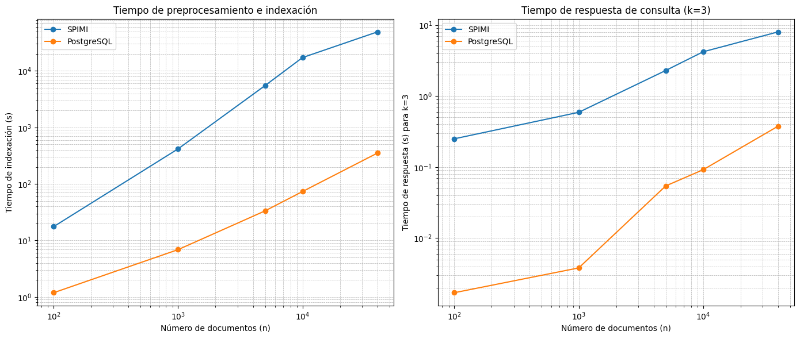
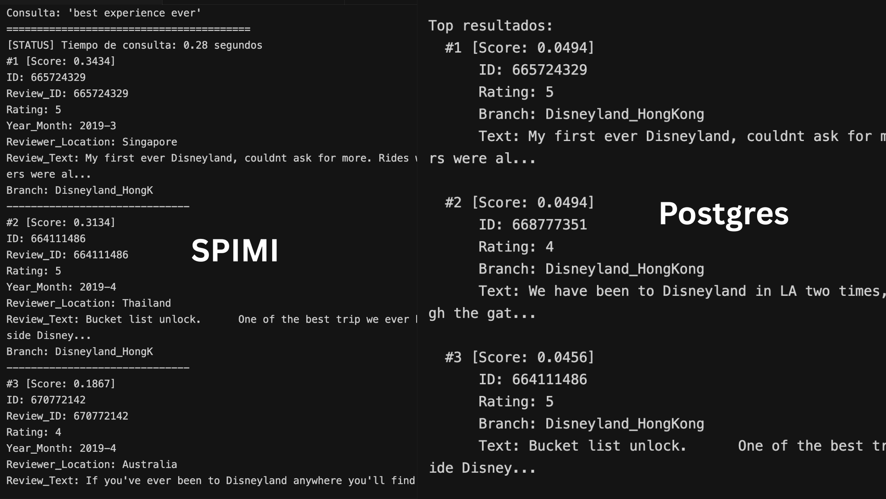

# Comparación de Rendimiento: SPIMI vs PostgreSQL

## Descripción

Se comparan dos métodos para indexar y consultar una colección de documentos:
- SPIMI (Single-pass in-memory indexing)
- PostgreSQL con indice GIN usando `tsvector`

Las métricas consideradas fueron:
- Tiempo de preprocesamiento e indexación
- Tiempo de respuesta para consultas k más similares con `k=3`
- Por consideraciones de tiempo para 40,000 documentos la entrada de SPIMI es aproximada (a excepción del tamaño del vocabulario).

Ambas fueron evaluadas con un crecimiento progresivo del tamaño de la colección (`n` documentos).

## Tabla Comparativa

|   n    | Vocab Size |  SPIMI Index (s)  |  SPIMI Query (s)  |  PG Index (s)  |  PG Query (s)  |
|--------|------------|-------------------|-------------------|----------------|----------------|
|  100   |   1,620    |       17.58       |       0.25        |     1.19       |     0.0017     |
| 1,000  |   5,198    |      417.18       |       0.59        |     6.88       |     0.0038     |
| 5,000  |  11,146    |    5,497.26       |       2.29        |    33.36       |     0.0542     |
|10,000  |  16,702    |   17,208.74       |       4.20        |    73.40       |     0.0917     |
|40,000  |  38,323    |   49,000.00       |       8.00        |   351.37       |     0.3761     |

## Resultados Visuales

Se muestran dos gráficas en escala log-log:

1. **Tiempo de indexación**
   - SPIMI tiene un comportamiento lineal pero en segundos tardando ~49,000s para 40,000 documentos.
   - PostgreSQL escala de forma mucho más eficiente, manteniéndose por debajo de los 400s.

2. **Tiempo de consulta (k=3)**
   - SPIMI tiene tiempos de respuesta aceptables, pero superiores a PostgreSQL.
   - PostgreSQL responde en milisegundos incluso con grandes volúmenes de datos.

## Similitud de resultado de las queries

El indice desarrollado si obtuvo resultados similares que postgres. Obteniendo
top k reviews overlapped o similares consistentemente.

