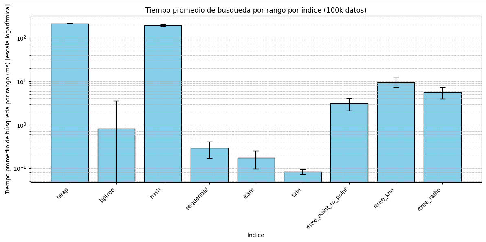

# Cuadros comparativos de desempeño, Gráficos resultantes y Análisis de resultados
En esta sección se mostraran los cuadros comparativos de las pruebas realizadas para analizar la eficiencia de los índices.

## Prueba 1: Tiempo de creación de los índices

Primero, se realizó la creación de la data con un total de 10k, 50k y 100k registros. 

Posteriormente, se realizó la medición del tiempo en que demora la creación de todos los índices sobre los datasets creados. 

Los experimentos se realizaron un total de 10 veces. Se sacó el tiempo máximo y mínimo, el tiempo promedio y la desviación estándar.

### Para 10k datos

**Cuadro 1:**

| Índice  | Máximo  | Mínimo  | Promedio | Desviación Estándar |
|--------------|---------|---------|----------|----------------------|
| **heap**     | 1.1552  | 0.7855  | 0.8731   | 0.0977               |
| **bptree**   | 1.8730  | 1.5849  | 1.6497   | 0.0864               |
| **hash**     | 2.7562  | 2.4452  | 2.5259   | 0.0888               |
| **sequential**| 13.6686 | 12.6166 | 12.9852  | 0.3435               |
| **isam**     | 1.0444  | 0.6843  | 0.8017   | 0.0903               |
| **brin**     | 2.6176  | 2.0207  | 2.2080   | 0.1659               |
| **rtree**    | 16.1120 | 15.1551 | 15.6448  | 0.2726               |

**Gráfico 1:**

## Para 50k datos

**Cuadro 2:**

| Índice   | Máximo  | Mínimo  | Promedio | Desviación Estándar |
|--------------|---------|---------|----------|----------------------|
| **heap**     | 4.4133  | 0.7714  | 2.3518   | 1.8331               |
| **bptree**   | 1.6583  | 1.5614  | 1.5869   | 0.0298               |
| **hash**     | 2.5319  | 2.4235  | 2.4672   | 0.0340               |
| **sequential**| 13.2518 | 12.6458 | 12.9419  | 0.2107               |
| **isam**     | 4.2747  | 0.1599  | 1.8330   | 1.7540               |
| **brin**     | 2.3651  | 2.0002  | 2.1657   | 0.1283               |
| **rtree**    | 16.8225 | 15.3492 | 15.9139  | 0.5156               |

**Gráfico 2:**

## Para 100k datos

**Cuadro 3:**

| Índice   | Máximo  | Mínimo  | Promedio | Desviación Estándar |
|--------------|---------|---------|----------|----------------------|
| **heap**     | 8.5390  | 0.8173  | 3.7171   | 3.8909               |
| **bptree**   | 1.7211  | 1.5699  | 1.6230   | 0.0490               |
| **hash**     | 2.5803  | 2.4541  | 2.4884   | 0.0463               |
| **sequential**| 13.1378 | 12.8701 | 12.9502  | 0.0890               |
| **isam**     | 8.1527  | 0.1676  | 2.5018   | 3.4176               |
| **brin**     | 2.4801  | 2.0721  | 2.2217   | 0.1340               |
| **rtree**    | 17.0213 | 15.5345 | 16.0672  | 0.5454               |

**Gráfico 3:**

**Análisis de los resultados:**

Los resultados obtenidos en la prueba de creación de índices revelan patrones. En primer lugar, los índices **heap** e **ISAM** muestran una alta variabilidad en sus tiempos de creación, especialmente en los conjuntos de datos más grandes (50k y 100k registros), con desviaciones estándar significativas (1.83 a 3.89 para heap y 1.75 a 3.42 para ISAM). Esto sugiere que estas estructuras, al carecer de una organización estricta (heap) o depender de particiones estáticas (ISAM), pueden verse afectadas por factores externos como la fragmentación de memoria o la gestión de archivos durante la inserción de datos. En contraste, los índices **B+Tree** y **hash** presentan tiempos más consistentes y predecibles, con desviaciones estándar bajas (0.03 a 0.09 para B+Tree y 0.03 a 0.09 para hash), lo que refleja su naturaleza optimizada para operaciones de inserción eficientes gracias a su estructura balanceada (B+Tree) o a la distribución uniforme mediante funciones hash.

Los índices que tuvieron menor tiempo para crearse fueron el Heap y el ISAM. Esto se debe a que el Heap no tiene una estructura definida, es decir, solo almacena los resgistros sin ningún tipo de orden. Por otro lado, la implementación de la creación del índice ISAM explicada en su documentación, hace que este tenga poco tiempo de creación. 

Por otro lado, los índices **sequential** y **rtree** destacan por ser los más lentos en términos absolutos, con promedios que superan los 12 ms y 15 ms, respectivamente, en todos los tamaños de datos. Esto se debe a sus diseños especializados: el índice sequential requiere un escaneo lineal y reorganización física de los datos, mientras que el rtree, optimizado para datos multidimensionales (como coordenadas espaciales), incurre en un alto costo computacional para construir su estructura jerárquica. Estos resultados confirman la teoría de que estos índices sacrifican velocidad de creación por beneficios en consultas específicas (búsquedas por rangos en sequential o consultas espaciales en rtree). El índice **brin**, aunque más rápido que sequential y rtree, muestra un rendimiento intermedio, ya que su diseño basado en rangos de bloques reduce la sobrecarga de creación pero aún requiere procesamiento adicional para resumir la información por bloques.

Finalmente, la escalabilidad de los índices se evidencia al comparar los tiempos entre los distintos tamaños de datos. Mientras que estructuras como B+Tree y hash mantienen tiempos estables independientemente del volumen (con incrementos mínimos del 10k al 100k), heap e ISAM experimentan fluctuaciones drásticas, lo que indica que su rendimiento es más sensible al tamaño de los datos. Esto refuerza la idea de que los índices balanceados (B+Tree) o de acceso directo (hash) son más adecuados para entornos con crecimiento dinámico de datos, mientras que heap e ISAM pueden ser menos predecibles en escenarios de gran escala.

## Prueba 2: Tiempo de búsqueda de los índices

Primero, se realizó la creación de la data con un total de 10k, 50k y 100k registros. 

El experimento consiste en que, de la data, se elige aleatoriamente un valor y se usan los índices para buscarlo. El único índice que elige uno distinto es el R-Tree, ya que solo trabaja con índices espaciales.

Los experimentos se realizaron un total de 100 veces. Se sacó el tiempo máximo y mínimo, el tiempo promedio y la desviación estándar.

### Para 10k datos

**Cuadro 1:**

| Índice   | Máximo  | Mínimo  | Promedio | Desviación Estándar |
|--------------|---------|---------|----------|----------------------|
| **heap**     | 77.6799 | 20.9570 | 22.8878  | 5.9423               |
| **bptree**   | 12.5291 | 0.1669  | 6.0920   | 3.5255               |
| **hash**     | 2.3029  | 0.3219  | 0.3957   | 0.2059               |
| **sequential**| 4.9536 | 0.1791  | 0.3439   | 0.5765               |
| **isam**     | 9.0532  | 0.0901  | 0.2693   | 0.9216               |
| **brin**     | 0.8597  | 0.1709  | 0.2238   | 0.0987               |
| **rtree**    | 7.1070  | 1.2891  | 3.0567   | 0.8668               |

**Gráfico 1:**

### Para 50k datos

**Cuadro 2:**

| Índice   | Máximo   | Mínimo  | Promedio | Desviación Estándar |
|--------------|----------|---------|----------|----------------------|
| **heap**     | 130.3728 | 103.8802| 106.4127 | 3.0323               |
| **bptree**   | 13.1109  | 0.0620  | 1.4266   | 3.1658               |
| **hash**     | 2.4242   | 0.3359  | 0.4321   | 0.2262               |
| **sequential**| 1.3051  | 0.1709  | 0.2654   | 0.1084               |
| **isam**     | 1.0371   | 0.0999  | 0.1792   | 0.1436               |
| **brin**     | 1.0898   | 0.0708  | 0.1279   | 0.1425               |
| **rtree**    | 6.1738   | 1.6038  | 2.8371   | 0.8836               |

**Gráfico 2:**

### Para 100k datos

**Cuadro 3:**

| Índice   | Máximo   | Mínimo  | Promedio | Desviación Estándar |
|--------------|----------|---------|----------|----------------------|
| **heap**     | 279.1712 | 209.3751| 214.6863 | 8.6746               |
| **bptree**   | 13.4051  | 0.0639  | 0.7753   | 2.6238               |
| **hash**     | 7.5009   | 0.3290  | 0.8703   | 1.3409               |
| **sequential**| 3.9210  | 0.2072  | 0.4883   | 0.5104               |
| **isam**     | 0.6797   | 0.1168  | 0.2212   | 0.0762               |
| **brin**     | 0.6790   | 0.0761  | 0.1228   | 0.0972               |
| **rtree**    | 6.1681   | 1.2310  | 2.6929   | 0.9718               |

**Gráfico 3:**

**Análisis de los resultados:**

Los resultados de la Prueba 2, que evalúa el tiempo de búsqueda en diferentes estructuras de índices, revelan comportamientos claramente diferenciados que se ajustan a las expectativas teóricas de cada tipo de índice. En primer lugar, el índice **heap**, al carecer de una estructura organizada, muestra los peores tiempos de búsqueda en todos los escenarios (promedios de 22.89 ms, 106.41 ms y 214.69 ms para 10k, 50k y 100k registros, respectivamente), con una escalabilidad deficiente. Esto se debe a que, sin un índice definido, el sistema debe realizar un escaneo secuencial completo (full table scan), lo que explica su crecimiento lineal con el tamaño de los datos y su alta desviación estándar (hasta 8.67 en 100k), indicando inconsistencia en el rendimiento.  

En contraste, los índices **hash** y **B+Tree** demuestran un rendimiento superior, aunque con diferencias clave. El índice **hash** destaca por su eficiencia en búsquedas puntuales (promedios de 0.40 ms, 0.43 ms y 0.87 ms), gracias a su acceso directo mediante la función hash, que idealmente ofrecen complejidad *O(1)*. Sin embargo, en el caso de 100k registros, su tiempo máximo aumenta significativamente (7.50 ms), posiblemente debido a colisiones en la función hash o a un incremento en la profundidad de las listas de overflow. Por otro lado, el **B+Tree**, aunque ligeramente más lento que el hash en casos óptimos, mantiene un rendimiento estable (promedios entre 0.78 ms y 6.09 ms) debido a su estructura balanceada, que garantiza un tiempo logarítmico, incluso con datos crecientes. Su desviación estándar relativamente alta (hasta 3.53) sugiere que algunas búsquedas pueden requerir más recorridos en el árbol, dependiendo de la ubicación del dato.  

Los índices **sequential**, **ISAM** y **BRIN** presentan tiempos de búsqueda notablemente bajos (todos con promedios menores a 0.50 ms en la mayoría de casos), lo que refleja su optimización para ciertos patrones de acceso. El **sequential** aprovecha el preordenamiento físico de los datos, lo que acelera las búsquedas secuenciales o por rangos. El **ISAM**, al estar basado en particiones estáticas indexadas, logra un acceso rápido a bloques específicos, aunque su rendimiento puede degradarse si hay desbalanceo en la distribución de datos. El **BRIN**, diseñado para datos correlacionados físicamente, reduce el overhead al trabajar con rangos de bloques en lugar de registros individuales, lo que explica su consistencia (desviación estándar ≤ 0.14 en 50k y 100k).  

Finalmente, el índice **R-Tree** muestra un rendimiento intermedio (promedios entre 2.69 ms y 3.06 ms), coherente con su especialización en consultas espaciales. Su estructura jerárquica, optimizada para regiones multidimensionales, introduce un costo adicional comparado con índices tradicionales, pero sigue siendo más eficiente que un escaneo secuencial. La baja variabilidad en sus tiempos (desviación estándar ≤ 0.97) sugiere que su comportamiento es predecible, independientemente del tamaño de los datos.  

 ## Prueba 3: Tiempo de búsqueda por rango de los índices

Primero, se realizó la creación de la data con un total de 10k, 50k y 100k registros. 

El siguiente experimento consiste en que, de la data, se elige aleatoriamente un rango y se procede a usar todos los índices para buscar dicho rango. El R-tree tiene 3 funciones que buscan dado un rango, por lo que para estas 3 funciones se eligieron rangos espaciales.

Los experimentos se realizaron un total de 100 veces. Se sacó el tiempo máximo y mínimo, el tiempo promedio y la desviación estándar.

### Para 10k

**Cuadro 1:**

| Índice             | Máximo   | Mínimo   | Promedio | Desviación Estándar |
|------------------------|----------|----------|----------|----------------------|
| **heap**               | 26.9928  | 20.8769  | 21.5296  | 0.6289               |
| **bptree**             | 12.1050  | 0.1438   | 5.9454   | 3.4346               |
| **hash**               | 262.8202 | 184.2222 | 196.4279 | 12.9245              |
| **sequential**         | 1.4780   | 0.1762   | 0.2560   | 0.1298               |
| **isam**               | 1.1051   | 0.0720   | 0.1182   | 0.1344               |
| **brin**               | 0.2930   | 0.0701   | 0.0874   | 0.0225               |
| **rtree_point_to_point** | 7.0190 | 1.3680   | 3.2386   | 0.8987               |
| **rtree_knn**          | 16.6841  | 3.4418   | 10.5534  | 2.3755               |
| **rtree_radio**        | 9.2432   | 2.4409   | 5.9142   | 1.4445               |

**Gráfico 1:**

### Para 50k

**Cuadro 2:**

| Índice             | Máximo   | Mínimo   | Promedio | Desviación Estándar |
|------------------------|----------|----------|----------|----------------------|
| **heap**               | 128.5312 | 106.2160 | 108.3308 | 2.2024               |
| **bptree**             | 13.0410  | 0.0668   | 1.3171   | 2.9216               |
| **hash**               | 211.9560 | 183.4760 | 190.0892 | 5.2127               |
| **sequential**         | 1.9648   | 0.1669   | 0.3020   | 0.1745               |
| **isam**               | 1.0121   | 0.0851   | 0.1638   | 0.1478               |
| **brin**               | 0.2339   | 0.0689   | 0.0859   | 0.0249               |
| **rtree_point_to_point** | 9.1083 | 1.6260   | 3.1636   | 1.0839               |
| **rtree_knn**          | 15.5158  | 3.3863   | 9.3521   | 2.7005               |
| **rtree_radio**        | 10.1259  | 3.1421   | 5.9650   | 1.5833               |

**Gráfico 2:**

### Para 100k

**Cuadro 3:**

| Índice             | Máximo   | Mínimo   | Promedio | Desviación Estándar |
|------------------------|----------|----------|----------|----------------------|
| **heap**               | 219.5749 | 210.7370 | 214.3201 | 1.4923               |
| **bptree**             | 12.7239  | 0.0691   | 0.8215   | 2.7184               |
| **hash**               | 247.9300 | 184.1941 | 194.4659 | 11.1113              |
| **sequential**         | 1.4760   | 0.2031   | 0.2908   | 0.1222               |
| **isam**               | 0.6952   | 0.0961   | 0.1748   | 0.0779               |
| **brin**               | 0.1931   | 0.0770   | 0.0828   | 0.0117               |
| **rtree_point_to_point** | 6.3679 | 1.1740   | 3.0954   | 0.9713               |
| **rtree_knn**          | 15.6000  | 3.5222   | 9.6166   | 2.4041               |
| **rtree_radio**        | 9.3052   | 2.2810   | 5.5537   | 1.6455               |

**Gráfico 3:**

### Análisis de los resultados:

Los resultados de la Prueba 3 sobre búsqueda por rango revelan diferencias significativas en el rendimiento de cada estructura de índices. El índice heap muestra un desempeño deficiente, con tiempos que crecen linealmente conforme aumenta el volumen de datos (promedios de 21.53 ms a 214.32 ms), ya que al carecer de organización requiere escanear toda la tabla. Este comportamiento era previsible dado que los heaps no están diseñados para operaciones eficientes de rango, sino para inserciones rápidas.

Por otro lado, el B+Tree demuestra un equilibrio notable, manteniendo tiempos de búsqueda relativamente bajos (0.82 ms a 5.95 ms) gracias a su estructura balanceada que permite localizar rápidamente el inicio del rango y luego recorrer secuencialmente las hojas. Sin embargo, su desviación estándar relativamente alta (hasta 3.43) indica que algunos rangos requieren más recorridos en el árbol que otros, dependiendo de su distribución.

El índice hash presenta los resultados más deficientes para esta operación (184.19 ms a 262.82 ms), lo cual era esperable pues las tablas hash están optimizadas para búsquedas exactas, no para rangos. Al no mantener ningún orden entre los elementos, la implementación probada debe examinar todos los buckets, volviéndose tan ineficiente como un escaneo secuencial pero con mayor variabilidad.

Los índices sequential, ISAM y BRIN sobresalen en esta prueba, mostrando los mejores tiempos de respuesta (todos bajo 0.30 ms en promedio). El sequential aprovecha el orden físico de los datos, el ISAM utiliza bloques indexados, y el BRIN trabaja con rangos de bloques, lo que les permite localizar intervalos con mínima sobrecarga. Particularmente el BRIN destaca por su consistencia (desviación estándar ≤ 0.02), siendo ideal para datos con correlación física.

El R-Tree demostró un comportamiento particularmente interesante en las pruebas de búsqueda por rango, con variaciones significativas entre sus tres operaciones evaluadas:

- **Búsqueda por región (point_to_point)**: Esta operación mostró los tiempos más consistentes (3.10 ms promedio en 100k registros) porque aprovecha eficientemente la estructura jerárquica del R-Tree. El índice organiza los datos en rectángulos mínimos delimitadores (MBRs) anidados, permitiendo descartar rápidamente regiones completas que no intersectan con el área de búsqueda. La baja desviación estándar (≤ 0.97) indica que el algoritmo mantiene un comportamiento predecible independientemente de la ubicación espacial del rango buscado.

- **Búsqueda por radio:** Con tiempos intermedios (5.55 ms promedio), esta operación requiere un procesamiento adicional respecto a la búsqueda por región. Aunque utiliza el mismo principio de filtrado por MBRs, debe:

   - Primero identificar los nodos que intersectan el círculo de búsqueda
   - Luego aplicar un filtro secundario para verificar qué elementos caen dentro del radio exacto
   - Finalmente calcular distancias para los candidatos restantes

 Este proceso explica por qué es aproximadamente 1.8 veces más lento que la búsqueda por región.

- **K-vecinos más cercanos (kNN):** La operación más costosa (9.62 ms promedio) debido a su naturaleza iterativa:

  - Requiere mantener una cola de prioridad de candidatos
  - Calcular múltiples distancias euclidianas
  - Expandir la búsqueda radialmente hasta encontrar los k elementos más cercanos
  - Revisar potencialmente múltiples nodos del árbol
    
La complejidad aumenta con el valor de k y la densidad de los datos, lo que se refleja en la mayor desviación estándar (≤ 2.40).

Un hallazgo importante es que los tiempos promedios se mantuvieron notablemente estables al aumentar el volumen de datos (variación < 5% entre 10k y 100k registros). Esto confirma la propiedad logarítmica (O(log n)) del R-Tree para consultas espaciales, donde el árbol crece en profundidad pero no en ancho de búsqueda promedio.

 ## Prueba 4: Tiempo de inserción de los índices

Primero, se realizó la creación de la data con un total de 10k, 50k y 100k registros. 

El siguiente experimento consiste en que insertaremos un elemento nuevo a los dataset usando los índices. Para el rtree, el elemento a insertar es distinto, porque es espacial.

Los experimentos se realizaron un total de 1000 veces. Se sacó el tiempo máximo y mínimo, el tiempo promedio y la desviación estándar.

### Para 10k datos

**Cuadro 1:**

| Índice   | Máximo   | Mínimo   | Promedio | Desviación Estándar |
|--------------|----------|----------|----------|----------------------|
| **heap**     | 4.3869   | 0.0787   | 0.0974   | 0.1402               |
| **bptree**   | 4.0939   | 0.2241   | 0.2914   | 0.1703               |
| **hash**     | 1.8542   | 0.1669   | 0.2063   | 0.0981               |
| **sequential**| 115.1390| 0.3409   | 1.3965   | 9.4312               |
| **isam**     | 1.3258   | 0.2198   | 0.5912   | 0.2072               |
| **brin**     | 1.9169   | 0.2558   | 0.3181   | 0.0767               |
| **rtree**    | 74.9481  | 1.2619   | 2.3190   | 5.0589               |

**Gráfico 1:**

### Para 50k datos

**Cuadro 2:**

| Índice    | Máximo   | Mínimo   | Promedio | Desviación Estándar |
|---------------|----------|----------|----------|----------------------|
| **heap**      | 29.6431  | 0.0789   | 0.1319   | 0.9345               |
| **bptree**    | 5.2688   | 0.2232   | 0.2880   | 0.2123               |
| **hash**      | 3.2201   | 0.1731   | 0.2296   | 0.1214               |
| **sequential**| 112.7710 | 0.3593   | 1.3744   | 9.3803               |
| **isam**      | 1.9917   | 0.2270   | 0.4785   | 0.1560               |
| **brin**      | 1.4510   | 0.2561   | 0.3221   | 0.0629               |
| **rtree**     | 76.7779  | 1.3378   | 2.1289   | 3.3316               |

**Gráfico 2:**

### Para 100k datos 

**Cuadro 3:**

| Índice    | Máximo   | Mínimo   | Promedio | Desviación Estándar |
|---------------|----------|----------|----------|----------------------|
| **heap**      | 4.9081   | 0.0770   | 0.0963   | 0.1530               |
| **bptree**    | 4.8842   | 0.2251   | 0.2952   | 0.1860               |
| **hash**      | 1.7910   | 0.1700   | 0.2118   | 0.0676               |
| **sequential**| 118.8538 | 0.3488   | 1.3937   | 9.5054               |
| **isam**      | 1.3392   | 0.2339   | 0.4353   | 0.1286               |
| **brin**      | 1.5900   | 0.2549   | 0.3123   | 0.0788               |
| **rtree**     | 76.2239  | 1.2519   | 2.3492   | 5.1619               |

**Gráfico 3:**

### Análisis de los resultados

Los resultados de la Prueba 4 revelan patrones de rendimiento claramente diferenciados en las operaciones de inserción. El índice **heap** demuestra ser de los más eficientes en operaciones de inserción (promedios entre 0.0963 ms y 0.1319 ms), ya que al carecer de estructura organizada simplemente añade los nuevos registros al final del almacenamiento, sin requerir operaciones adicionales de mantenimiento. Esta simplicidad explica sus tiempos mínimos, aunque su alta desviación estándar (hasta 0.9345) en el caso de 50k registros sugiere cierta inconsistencia posiblemente relacionada con la gestión de espacio en memoria.

Los índices **B+Tree** y **hash** presentan un rendimiento intermedio pero consistente (promedios entre 0.2063 ms y 0.2952 ms). En el caso del B+Tree, este tiempo refleja el costo de mantener el árbol balanceado, que incluye la división de nodos cuando se llenan. La estructura hash, por su parte, muestra tiempos ligeramente mejores gracias a su mecanismo directo de direccionamiento, aunque su rendimiento puede degradarse cuando se producen colisiones frecuentes o cuando es necesario hacer splits de los buckets. La baja desviación estándar en ambos casos (≤ 0.2123) indica un comportamiento predecible independientemente del tamaño de los datos.

El índice **sequential** muestra el peor rendimiento en operaciones de inserción (promedios alrededor de 1.39 ms), con tiempos máximos que superan los 100 ms. Esto era previsible dado que este tipo de índice requiere mantener el orden físico de los datos, lo que frecuentemente implica costosas operaciones de reorganización y desplazamiento de registros. Su alta desviación estándar (≈9.38-9.50) sugiere que algunas inserciones son particularmente costosas cuando ocurren en posiciones que requieren grandes reubicaciones de datos.

Los índices **ISAM y BRIN** presentan un comportamiento interesante. El ISAM (promedios entre 0.4353 ms y 0.5912 ms) muestra mejor rendimiento que el sequential gracias a su estructura de bloques fijos, aunque su tiempo de inserción puede variar significativamente dependiendo de la disponibilidad de espacio en los bloques destino. El BRIN, por su parte, mantiene tiempos consistentes (≈0.31-0.32 ms) debido a que solo necesita actualizar los metadatos de rangos cuando es necesario, sin requerir reorganizaciones complejas.

El índice **R-Tree** muestra los tiempos de inserción más altos entre los índices especializados (promedios entre 2.1289 ms y 2.3492 ms), lo que refleja la complejidad de mantener una estructura jerárquica multidimensional. Cada inserción requiere:

- Encontrar la posición adecuada en la estructura jerárquica

- Ajustar los rectángulos delimitadores (MBRs) de los nodos padres

- Gestionar posibles divisiones de nodos

- Mantener las propiedades espaciales del árbol

Esta complejidad se ve agravada por la naturaleza de los datos espaciales, donde la inserción de un nuevo elemento puede afectar múltiples niveles de la estructura. La alta desviación estándar (3.3316-5.1619) sugiere que ciertas inserciones - particularmente aquellas que desencadenan rebalances completos - son significativamente más costosas que otras.

