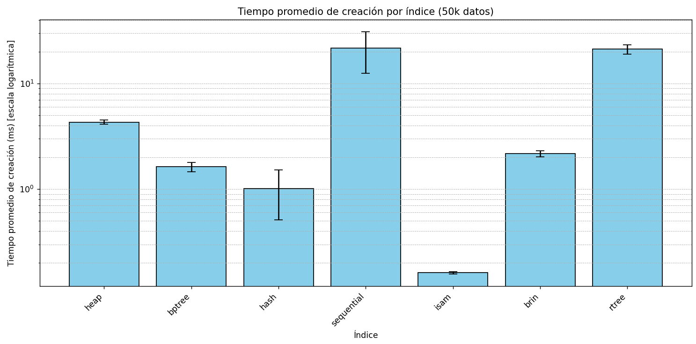
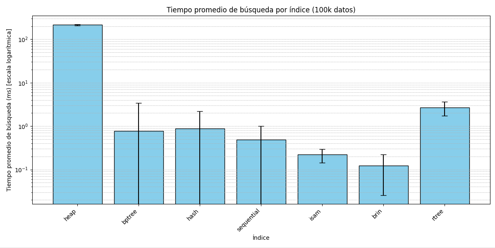

# Cuadros comparativos de desempeño y Gráficos resultantes
En esta sección se mostraran los cuadros comparativos de las pruebas realizadas para analizar la eficiencia de los índices.

## Prueba 1: Tiempo de creación de los índices

Primero, se realizó la creación de la data con un total de 10k, 50k y 100k registros. 

Posteriormente, se realizó la medición del tiempo en que demora la creación de todos los índices sobre los datasets creados. 

Los experimentos se realizaron un total de 10 veces. Se sacó el tiempo máximo y mínimo, el tiempo promedio y la desviación estándar.

### Para 10k datos

**Cuadro 1:**

| Índice  | Máximo  | Mínimo  | Promedio | Desviación estándar |
|------------|---------|---------|----------|---------------------|
| heap       | 0.8802  | 0.8502  | 0.8515   | 0.0118             |
| bptree     | 4.7545  | 4.5852  | 4.6746   | 0.0479             |
| hash       | 1.1640  | 0.9014  | 0.9747   | 0.0659             |
| sequential | 13.4000 | 12.7459 | 13.0642  | 0.2164             |
| isam       | 0.8259  | 0.7195  | 0.7604   | 0.0300             |
| b+tree     | 2.3175  | 2.1017  | 2.1996   | 0.0715             |
| brin       |  2.3175 |  2.1017 |   2.1926 | 0.0715             |
| rtree      | 18.0558 | 15.6037 | 16.2561  | 0.6891             |

**Gráfico 1:**

## Para 50k datos

**Cuadro 2:**

| Índice  | Máximo  | Mínimo  | Promedio | Desviación estándar |
|------------|---------|---------|----------|---------------------|
| heap       |  4.4945 |    4.0597 |    4.2522   |            0.1413
| bptree     | 24.9364 |  23.2780 |  24.1668    |           0.6065
| hash       |  5.1580 |   4.6373  |  4.9331   |            0.1444
| sequential | 194.1880|  123.2771 | 136.9370   |           22.3715
| isam       |  8.7689 |   0.7844  |  4.7419   |            1.8931
| brin       | 12.0356 |  10.7354  | 11.4294  |             0.4130
| rtree      | 111.5006|   99.6812 | 102.1979  |             3.3986

**Gráfico 2:**

## Para 100k datos

**Cuadro 3:**

| Índice  | Máximo  | Mínimo  | Promedio | Desviación estándar |
|------------|---------|---------|----------|---------------------|
| heap      |    9.9383  |  8.5679  |  9.1891    |           0.4986
| bptree    |   48.1742  | 46.5679  | 47.3221     |          0.5495
| hash      |   10.0901  |  9.2679  |  9.6477    |           0.2658
| sequential | 384.3457  | 333.1405 | 345.2762    |          14.5160
| isam       |   9.8901  |  9.3679  |  9.5809      |         0.1738
| brin      |   22.8901  | 21.5679  | 22.2035     |          0.4211
| rtree   |    216.0901   | 206.7787 | 211.9692    |           3.2453

**Gráfico 3:**

**Análisis de los resultados:**

bla bla bla

## Prueba 2: Tiempo de búsqueda de los índices

Primero, se realizó la creación de la data con un total de 10k, 50k y 100k registros. 

El experimento consiste en que, de la data, se elige aleatoriamente un valor y se usan los índices para buscarlo. El único índice que elige uno distinto es el R-Tree, ya que solo trabaja con índices espaciales.

Los experimentos se realizaron un total de 100 veces. Se sacó el tiempo máximo y mínimo, el tiempo promedio y la desviación estándar.

### Para 10k datos

**Cuadro 1:**

Estadísticas de búsqueda para 10k datos:
| Índice | Máximo | Mínimo | Promedio | Desviación estándar |
|---|---|---|---|---|
| **heap** | 109.2489 | 21.2142 | 25.8303 | 15.4849 |
| **bptree** | 14.2710 | 0.2339 | 2.6486 | 2.3920 |
| **hash** | 15.2411 | 3.4630 | 6.1803 | 2.2295 |
| **sequential** | 0.3030 | 0.1640 | 0.2074 | 0.0209 |
| **isam** | 0.1700 | 0.0839 | 0.0945 | 0.0132 |
| **brin** | 0.2739 | 0.1678 | 0.1885 | 0.0156 |
| **rtree** | 6.5470 | 1.2460 | 2.9170 | 0.8109 |

**Gráfico 1:**

### Para 50k datos

**Cuadro 2:**

Estadísticas de búsqueda para 50k datos:
| Índice | Máximo | Mínimo | Promedio | Desviación estándar |
|---|---|---|---|---|
|heap     |   110.6761 | 104.4061 | 106.2733    |           0.7796
|bptree    |   20.6022 |  16.0282 |  18.1881    |           1.1928
|hash     |    40.6990 |  10.1662  | 17.5435     |          5.7658
|sequential |   0.4752 |   0.1929  |  0.2707      |         0.0432
|isam    |      0.1721  |  0.1030  |  0.1155      |         0.0118
|brin    |      0.3541  |  0.2019  |  0.2386      |         0.0260
|rtree   |     13.5860  |  1.9431  |  5.0128       |        1.6829

**Gráfico 2:**

### Para 100k datos

**Cuadro 3:**

Estadísticas de búsqueda para 100k datos:
| Índice | Máximo | Mínimo | Promedio | Desviación estándar |
|---|---|---|---|---|
| heap   |      219.5561|   211.0779 |  213.3680     |           1.0849
| bptree  |     41.1952 |  36.3290  |  38.5349      |         1.1396
| hash    |      69.0191 |   18.8599   | 32.6498     |          10.8614
| sequential |    0.4301  |   0.1888  |   0.2590     |           0.0398
| isam    |       0.2289  |   0.1061   |  0.1174      |          0.0161
| brin    |       0.3572  |   0.2041   |  0.2239      |          0.0236
| rtree   |      15.6963  |   2.2700   |  6.5242       |         2.7146

**Gráfico 3:**

**Análisis de los resultados:**
